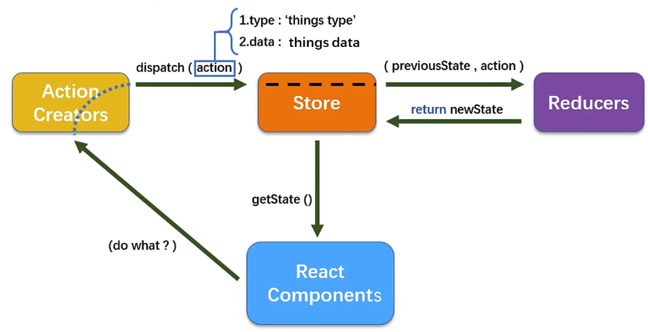

学习视频：[尚硅谷2021版React技术全家桶全套完整版](https://www.bilibili.com/video/BV1wy4y1D7JT?p=1)

## 简介

> React 是一个将数据渲染为HTML视图的开源JavaScript库。 ——Facebook

**原生JavaScript的痛点**

* 原生JavaScript操作DOM繁琐、效率低（DOM-API 操作UI)
* 使用JavaScript直接操作DOM，浏览器会进行大量的重绘重排
* 原生JavaScript没有组件化编码方案，代码复用率低

**React的特点**

* 采用组件化模式、声明式编码，提高开发效率及组件复用率
* React Native中可以使用React语法进行移动端开发
* 使用虚拟DOM+优秀的Diffing算法，尽量减少与真实DOM的交互
<!-- more -->
## 基本使用

### 导入

```html
<script src="https://cdn.staticfile.org/react/16.4.0/umd/react.development.js"></script>
<script src="https://cdn.staticfile.org/react-dom/16.4.0/umd/react-dom.development.js"></script>
<script src="https://cdn.staticfile.org/babel-standalone/6.26.0/babel.min.js"></script>
```

### 使用

```html
<script type="text/babel">
   // 1.创建虚拟DOM
   const VDOM = <h1>Hello, React</h1>
   // 不写引号，不是字符串
   // 2.渲染虚拟DOM到页面
   ReactDOM.render(VDOM, document.getElementById('test'))
</script>
```

## 虚拟DOM

### 关于虚拟DOM

* 本质是Object 对象

### 创建虚拟DOM

**使用js创建虚拟DOM**

```js
// React.createElement(标签名， 属性对象， 元素内容)
const VDOM = React.createElement('h1', {id: 'title'}, React.createElement('span', {}, 'Hello, React'))
```

**使用jsx创建虚拟DOM**

```js
const VDOM = (
	<h1 id="title">
		<span>Hello, React</span>
	</h1>
)
```

## jsx

> JavaScript XML：react 定义的一种类似于XML的JS扩展语法：JS+XML

语法规则

* 定义虚拟DOM时，不要写引号
* 标签中混入JS表达式要用{}
* 样式的类名指定不要用class，要用className
* 内联样式，要用`style={{key:value}}`的形式去写
* 只能有一个根标签
* 标签必须闭合
* 标签首字母
  * 小写字母开头，则将该标签转为html中的同名元素，若html中无该标签对应的同名元素，则报错。
  * 大写字母开头，react就去渲染对应的组件，若组件没有定义，则报错。

## React面向组件编程

### 组件基本使用

* 函数式组件（适用于简单组件）

  ```js
  // 1.创建函数式组件
  function MyComponent () {
    console.log(this) // 此处的this是undefined，因为babel编译后开启了严格模式
    return <h2>我是函数定义的组件</h2>
  }
  // 2.渲染组件到页面
  ReactDOM.render(<MyComponent/>, document.getElementById('test')) 
  ```

* 类式组件（适用于复杂组件）

  > 类的知识点
  >
  > 1. 类中的构造器constructor不是必须写的，要对实例进行一些初始化的操作，如添加指定属性时才写
  > 2. 如果A类继承了B类，而且A类中写了构造器，那么A类的构造器中的super是必须要调用的
  > 3. 类中所定义的方法，都是放在了类的原型对象上，供实例去使用

  ```js
  // 1.创建类式组件
  class MyComponent extends React.Component{
    render () {
      return <h2>我是用类定义的组件</h2>
    }
  }
  // 2.渲染组件到页面
  ReactDOM.render(<MyComponent/>, document.getElementById('test'))
  ```

### 组件三大核心属性1：state

**介绍**

state是组件对象最重要的属性，值是对象

组件被称为“状态机”，通过更新组件的state来更新对应的页面显示

**注意**

* 组件中的render方法中的this为组件实例对象
* 组件自定义的方法中this为undefined，如何解决
  * 强制绑定this，通过函数对象的bind（）
  * 箭头函数
* 状态数据，不能直接修改或更新，需要通过setState这个API

```js
// 1.创建组件
class Weather extends React.Component{
  constructor (props) {
    super(props)
    this.state = {
      isHot: false,
      wind: '大风'
    }
    // 解决this指向问题
    this.changeWeather = this.changeWeather.bind(this)
  }
  render () {
    // 读取状态
    let {isHot} = this.state
    console.log(this)
    return <h1 onClick={this.changeWeather}>今天天气很{isHot ? '炎热' : '凉爽'}</h1>
  }
  changeWeather () {
    // state不可直接更改，要借助内置的API(setState)去更改
    this.setState({
      isHot: !this.state.isHot
    })
  }
}
// 2.渲染虚拟DOM到页面
ReactDOM.render(<Weather/>, document.getElementById('test'))
```

### 组件三大核心属性2：props

> 组件中的参数

```js
// 1.创建组件
class Person extends React.Component{
  render () {
    const {name, sex, age} = this.props
    return (
    <ul>
      <li>姓名：{name}</li>
      <li>性别： {sex}</li>
      <li>年龄： {age}</li>  
    </ul>
    )
  }
}

const p = {
  name: "jeffrey",
  age: "18",
  sex: "男"
}
// 2.渲染虚拟DOM到页面
ReactDOM.render(<Person name="tom" age="18" sex="男"/>, document.getElementById('test'))
ReactDOM.render(<Person {...p}/>, document.getElementById('test2'))
```

**对传输的props进行限制**

* 在类外层定义

```html
// 1.先导入prop-types.js
<script src="https://cdn.bootcdn.net/ajax/libs/prop-types/15.5.10/prop-types.js"></script>

// 2.设置类型和默认值
<script type="text/babel">
	// 设置类型
    Person.propTypes = {
      // isRequest 必传
      name: PropTypes.string.isRequired,
      sex: PropTypes.string,
      speak: PropTypes.func
    }
    // 设置默认值
    Person.defaultProps = {
      sex: '女'
    }
</script>
```

* 在类内部定义（推荐）

```js
// 创建组件
class Person extends React.Component{
  render () {
    const {name, sex, age} = this.props
    return (
    <ul>
      <li>姓名：{name}</li>
      <li>性别： {sex}</li>
      <li>年龄： {age + 1}</li>  
    </ul>
    )
  }
  // 标签类型限制
  static propTypes = {
    name: PropTypes.string.isRequired,
    sex: PropTypes.string,
  }
  // 标签默认值
  static defaultProps = {
    sex: '女'
  }
}
```

## 组件三大核心属性3：refs

### 字符串型ref（过时）

```js
// 创建组件
class Demo extends React.Component{
  showData = () => {
    const input = this.refs.input1
    console.log(input.value)
  }
  render () {
    return (
      <div>
        <input ref="input1" type="text" placeholder="点击按钮提示数据"/>&nbsp;
        <button onClick={this.showData}>点我提示左侧的数据</button>&nbsp;
      </div>
    )
  }
}
```

### 回调函数型ref

```js
class Demo extends React.Component{
  showData = () => {
    console.log(this.input1.value)
  }
  render () {
    return (
      <div>
        <input ref={c => this.input1 = c} type="text" placeholder="点击按钮提示数据"/>&nbsp;
        <button onClick={this.showData}>点我提示左侧的数据</button>&nbsp;
      </div>
    )
  }
}
```

### createRef型（推荐）

```js
class Demo extends React.Component{
  // React.createRef 调用后可以返回一个容器，该容器可以储存被ref所标识的节点
  // 该容器是“专人专用”的,只能用于一个element
  myRef = React.createRef()
  showData = () => {
    console.log(this.myRef.current.value)
  }
  render () {
    return (
      <div>
        <input ref={this.myRef} type="text" placeholder="点击按钮提示数据"/>&nbsp;
        <button onClick={this.showData}>点我提示左侧的数据</button>&nbsp;
      </div>
    )
  }
}
```

## 生命周期


### **旧版**


1. 初始化阶段： 由ReactDOM.render()触发--初次渲染
   * constructor()
   * componentWillMount()
   * render()
   * componentDidMount()  ==> 常用：开启定时器、发送请求、订阅消息
2. 更新阶段：由组件内部this.setState()或父组件重新render触发
   * shouldComponentUpdate()
   * componentWillUpdate()
   * render() ==> 必须使用的一个
   * componentDidUpdate()
3. 卸载组件： 由ReactDOM.unmountComponentAtNode()触发
   * componentWillUnmount()  ==> 常用：清除定时器、取消订阅消息

### 新版


1. 初始化阶段： 由ReactDOM.render()触发--初次渲染
   * constructor()
   * <mark>getDerivedStateFromProps()</mark>
   * render()
   * componentDidMount()  ==> 常用：开启定时器、发送请求、订阅消息
2. 更新阶段：由组件内部this.setState()或父组件重新render触发
   * <mark>getDerivedStateFromProps()</mark>
   * shouldComponentUpdate()
   * render() ==> 必须使用的一个
   * <mark>getSnapshotBeforeUpdate()</mark>
   * componentDidUpdate()
3. 卸载组件： 由ReactDOM.unmountComponentAtNode()触发
   * componentWillUnmount()  ==> 常用：清除定时器、取消订阅消息

## Diffing算法

### 虚拟DOM中key的作用

* key是虚拟DOM对象的标识，当状态中的数据发生变化时，react会[新数据]生成[新的虚拟DOM]，随后React进行[新虚拟DOM]与[旧虚拟DOM]的diff比较，比较规则如下：
* 旧虚拟DOM中找到了与新虚拟DOM相同的key：
  * 若虚拟DOM中内容没变，直接使用之前的真实DOM
  * 若虚拟DOM中内容变了，则生成新的真实DOM，随后替换到页面中之前的真实DOM
* 旧虚拟DOM中未找到与新虚拟DOM相同的key，根据数据创建新的真实DOM，随后渲染到页面

### 用index作为key可能引发的问题

* 若对数据进行：逆序添加、逆序删除等破坏顺序操作会产生没有必要的真实DOM更新
* 如果结构中还包含输入类的DOM：会产生错误DOM更新

## react脚手架搭建项目

1. 全局安装脚手架

   ```shell
   yarn add -g create-react-app
   ```

2. 切换到想创建项目的目录，使用命令

   ```shell
   npx create-react-app hello-react
   ```

3. 进入项目文件夹

   ```shell
   cd hello-react
   ```

4. 启动项目

   ```shell
   npm start
   ```

## 跨域问题

### **方法一**

> 在package.json中追加如下配置

```json
"proxy": "http://localhost:5000"
```

优点：配置简单，前端请求资源时不加任何前缀

缺点：不能配置多个代理

工作方式：当请求了自身端口不存在的资源时，该请求会转发给5000

### **方法二**

1. 创建代理配置文件

   ```js
   在src下创建配置文件：src/setupProxy.js
   ```

2. 编写setupProxy.js配置具体代理规则

   ```js
   const proxy = require('http-proxy-middleware')
   
   module.exports = function (app) {
     app.use(
       proxy('/api1', {
         target: 'http://localhost:5000',
         changeOrigin: true,  // 控制服务器接收到的请求头中host字段的值，true：5000，false：3000
         pathRewrite: { // 去除请求前缀，保证交给后台服务器是正常请求地址（必填）
           '^/api1': ''
         }
       }),
       proxy('/api2', {
         target: 'http://localhost:5001',
         changeOrigin: true,
         pathRewrite: {
           '^/api2': ''
         }
       })
     )
   } 
   ```

优点：可以配置多个代理，可以灵活控制请求是否代理

缺点：配置繁琐，前端请求资源时必须加前缀

## 消息订阅—发布机制

工具库： PubSubJs

## github搜索案例相关知识点

* 设计状态时要考虑全面，例如带有网络请求的组件，要考虑请求失败怎么办

* ES6小知识点：结构赋值+重命名

  ```js
  let obj = {a: {b: 1}}
  const {a} = obj // 传统解构赋值
  const {a: {b}} = obj // 连续解构赋值
  const {a: {b: value}} = obj // 连续解构赋值+重命名
  ```

* 消息订阅与发布机制

  * 先订阅，在发布
  * 适用于任意组件间通信
  * 要在组件的componentWillUnmount中取消订阅

* fetch 发送请求（关注分离的设计思想）

  ```js
  try {
      const response = await fetch(`/api1/search/users`)
      const data = await response.json()
      console.log(data)
  } catch (error) {
      console.log('请求出错', error)
  }
  ```

  

## React路由

### SPA的理解

* 单页Web应用（single page web application， SPA）
* 整个应用只有一个完整的页面
* 点击页面中的链接不会刷新页面，只会做页面的局部更新
* 数据都需要通过ajax请求获取，并在前端异步展示

### 路由的理解

**路由**

一个路由就是一个映射关系（key:value)，key为路径，value可能是function或component

**路由分类**

* 后端路由
  * value是function，用来处理客户端提交的提交。
  * 注册路由：router.get(path, function(req, res))
  * 工作过程：当node接收到一个请求时，根据请求路径找到匹配的路由，调用路由中的函数来处理请求，返回响应数据
* 前端路由
  * 浏览器端路由，value是component，用户展示页面内容
  * 注册路由：`<Route path="/test" component={Test}>`
  *  工作过程：当浏览器的path变为/test时，当前路由组件就变为Test组件

**react-router的理解**

* react的一个插件库
* 专门用来实现一个SPA应用
* 基于react的项目基本都会用到此库

### 路由的基本使用

1. 安装路由插件

   ```shell
   yarn add react-router-dom@5
   ```

2. 导入需要的组件

   ```jsx
   import {Link, BrowserRouter, Route} from 'react-router-dom'
   ```

3. 在<App>组件的最外侧包裹一个<BrowserRouter>或<HashRouter>

4. 导航区用Link标签

   ```jsx
   <Link to="/xxx">Demo</Link>
   ```

5. 展示区写Route标签进行路径的匹配

   ```jsx
   <Route path="/xxx" component={Demo}></Route>
   ```

### 路由组件与一般组件

| 组件  | 一般组件     | 路由组件                              |
| ----- | ------------ | ------------------------------------- |
| 写法  | <Demo/>      | <Route to="/demo" component={Demo} /> |
| 位置  | components   | pages                                 |
| props | 写什么传什么 | 固定属性：history 、location、match   |

**路由组件中props的详情**

* history:  go 、goBack 、 goForward 、 push 、 replace
* location: pathname 、 search 、state
* match: params、 path 、url


> **withRouter可以加工一般组件，让一般组件具有路由组件所特有的API**

```jsx
import {withRouter} from 'react-router-dom'
export default  withRouter(Demo)
```


### NavLink和封装NavLink

> 安装react-router-dom时要用@5版本，不然最新版本NavLink不生效

1. NavLink可以实现路由链接的高亮，通过activeClassName指定样式名，默认是active
2. 标签体内容是一个特殊的标签属性，通过this.props.children可以获取

**封装NavLink**

```jsx
import React, {Component} from 'react'
import { NavLink } from 'react-router-dom'
export default class MyNavLink extends Component {
  render () {
    return (
      <NavLink activeClassName="selected" className="list-group-item" {...this.props}></NavLink>
    )
  }
}
```

### Switch的使用

1. 通常情况下，path和component是一一对应的关系。
2. Switch可以提高路由匹配效率（单一匹配）。

```jsx
<Switch>
    <Route path="/about" component={About}></Route>
    <Route path="/home" component={Home}></Route>
    <Route path="/home" component={Test}></Route>
</Switch>
```

### 路由的严格匹配和模糊匹配

1. 默认使用的是模糊匹配
2. 利用exact开启严格匹配

```jsx
< Link to="/home/a/b" /> 
<Route exact path="home">匹配失败</Route> 
<Route path="home">匹配成功</Route>
```

### 向路由组件传递参数

1. params参数

   ```jsx
   {/* 路由链接（携带参数） */}
   <Link to='/demo/test/tom/18'}>详情</Link>
       
   {/* 注册路由（声明接收） */}
   <Route path='/demo/test/:name/:age' component={Test}</Link> 
   
   {/* 接收参数 */}
   const {name, age} = this.props.match.params  
   ```

2. search参数

   ```jsx
   {/* 路由链接（携带参数） */}
   <Link to='/demo/test?name=tom&age=18'}>详情</Link>
       
   {/* 注册路由（无需声明，正常注册） */}
   <Route path='/demo/test/' component={Test}</Link> 
   
   {/* 接收参数 */}
   const {search} = this.props.location
       
   {/* 备注：获取的search是urlencoded编码字符串，需要借助query-string解析 */}
   ```

3. state参数

   ```jsx
   {/* 路由链接（携带参数） */}
   <Link to={{path: '/demo/test', state: {name:'tom', age:18}}}>详情</Link>
       
   {/* 注册路由（无需声明，正常注册） */}
   <Route path='/demo/test/' component={Test}</Link> 
   
   {/* 接收参数 */}
   const {id, title} = this.props.location.state || {}
   ```

### 编程式路由导航

借助this.props.history对象上的API操作路由跳转、前进、后退

* this.props.history.push()
* this.props.history.replace()
* this.props.history.goBack()
* this.props.history.goForward()
* this.props.history.go()

### BrowserRouter和HashRouter

|          | BrowserRouter                        | HashRouter                |
| -------- | ------------------------------------ | ------------------------- |
| 底层原理 | 使用H5的history API，不兼容IE9及以下 | 使用URL的哈希值，兼容性好 |
| path表现 | 没有#                                | 包含#                     |
| 刷新影响 | 没有影响，state仍在history对象中     | state参数丢失             |
| 备注     |                                      | 可用于解决路径相关错误    |


## redux

### redux是什么

1. redux是一个专门用于状态管理的JS库
2. 它可以用在react、angular、vue等项目中，但基本与react配合使用
3. 作用：集中式管理react应用中多个组件共享的状态。

### 使用场景

1. 某个组件的状态，需要让其他组件可以随时拿到（共享）。
2. 一个组件需要改变另一个组件的状态（通信）。
3. 总体原则：能不用就不用，如果不用比较吃力才考虑使用。

### 工作流程



### 核心概念

**action**

* 动作的对象
* 包含2个属性
  * type：标识属性，值为字符串，唯一，必要属性
  * data：数据属性，值为任意类型，可选属性
* 例子：{type:'ADD_STUDENT', data: {name: 'tom', age: 18}}

**reducer**

* 用于初始化状态、加工状态
* 加工时，根据旧的state和action，产生新的state的**纯函数**

**store**

* 将state、action、reducer联系在一起的对象

* 得到此对象的方法

  ```jsx
  import {createStore} from 'redux'
  import reducer from './reducers'
  const store = createStore(reducer)
  ```

* 此对象的功能？

  * getState():得到state
  * dispatch(action):分发action，触发reducer调用，产生新的state
  * subscribe(listener):注册监听，当产生新的state时，自动调用

### redux的核心API

**createStore()**

* 创建包含指定reducer的store对象

**store对象**

* redux库最核心的管理对象

* 维护着state 、 reducer

* 核心方法： getState(), dispatch(action), subscribe(listener)

* 具体编码

  ```js
  store.getState()
  store.dispatch({type: 'INCREMENT', number})
  store.subscribe(render)
  ```

**applyMiddleware()**

* 应用上基于redux的中间件(插件库)

**combineReducers()**

* 作用：合并多个reducer函数

### 异步编程

**理解**

1. redux默认是不能进行异步处理的
2. 某些时候应用中需要在redux中执行异步任务（ajax,定时器)

**使用异步中间件**

1. 安装redux-thunk插件

   ```shell
   npm install redux-thunk
   ```

2. 在store.js中引入并作为createStore的第二个参数传入

   ```js
   import thunk from 'redux-thunk'
   const store = createStore(allReducer,applyMiddleware(thunk)))
   ```

### react-redux

**理解**

1. 一个react插件库
2. 专门用来简化react应用中使用redux

**react-redux将所有组件分成两大类**

1. UI组件
   1. 只负责UI的呈现，不带有任何业务逻辑
   2. 通过porps接收数据（一般数据和函数）
   3. 不使用任何Redux的API
   4. 一般保存在components文件夹下
2. 容器组件
   1. 负责管理数据和业务逻辑，不负责UI的呈现
   2. 使用Redux的API
   3. 一般保存在containers文件夹下

**相关API**

1. Provider：让所有组件都可以得到state数据

   ```jsx
   <Provider store={store}>
   	<App/>
   </Provider>
   ```

2. connect: 用于包装UI组件生成容器组件

   ```jsx
   import { connect } from 'react-redux'
   connect(
   	mapStateToProps,
       mapDispatchToProps
   )(Counter)
   ```

3. mapStateToProps: 将外部数据转换为UI组件的标签属性

   ```js
   const mapStateToProps = state => ({key: state.key})
   ```

4. mapDispatchToProps:将分发action的函数转换为UI组件的标签属性


